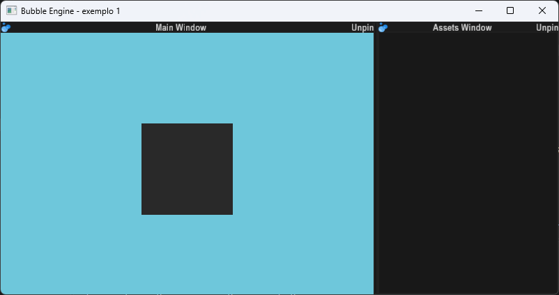

Bubble Engine
===



[](https://github.com/D4nielStone/cpp-bengine/actions/workflows/build_and_test.yml)

    
Bubble Engine is an experimental C++ engine for windowing, rendering,
physics, and component-based entities. The project is still under
development and provides runtime and editor applications.
Dependencies
The following must be installed:
 - CMake 3.20 or higher
 - A compiler with C++23 support
 - Lua 5.3
 - GLFW
 - GLM
 - Assimp
 - FreeImage
 - FreeType
 - Bullet

The sol2, rapidjson, and glad libraries are maintained in the repository or
as submodules. When cloning the project, initialize them with:
git submodule update --init --recursive

Building
From the project root:
```
cmake -S . -B out
cmake --build out
```
The runtime and editor applications will be generated in the out/apps
directory. Run either application with:
```
./out/apps/runtime_app
./out/apps/editor_app
```

Structure
 * commons/: reusable static library of the engine.
 * apps/: runtime and editor applications using the engine.
 * external/: dependencies included in the project.
Installing
To install the library and headers to a specific prefix:
```
cmake --install out --prefix install
```
